下面我将详细介绍这些技术栈，包括它们的基本概念、核心功能、应用场景以及相互之间的关系：

### 1. MQTT (消息队列遥测传输)
**核心概念**：轻量级发布/订阅消息传输协议  
**主要特点**：
- 专为低带宽、高延迟或不稳定网络环境设计
- 支持三种服务质量（QoS）级别：
  - QoS 0：最多一次（可能丢失）
  - QoS 1：至少一次（可能重复）
  - QoS 2：恰好一次（可靠传输）
- 基于主题的消息路由（topic-based routing）
- 低功耗设计，适合IoT设备

**应用场景**：
- 物联网设备通信（传感器数据采集）
- 移动应用推送通知
- 车联网通信
- 智能家居设备控制

**架构组件**：
- Broker：消息代理服务器（如Mosquitto, EMQX）
- Publisher：消息发布者
- Subscriber：消息订阅者

### 2. 消息队列 (Message Queue)
**核心概念**：应用间异步通信机制  
**主要模式**：
- 点对点（Queue）
- 发布/订阅（Pub/Sub）

**主流实现**：
- Kafka：高吞吐分布式流平台
- RabbitMQ：AMQP协议实现，企业级消息代理
- RocketMQ：阿里开源，金融级可靠性
- ActiveMQ：JMS规范实现

**关键特性**：
- 解耦生产者和消费者
- 流量削峰
- 保证消息顺序
- 失败重试机制

**应用场景**：
- 微服务间通信
- 订单处理系统
- 日志收集
- 事件驱动架构

### 3. ES数据库 (Elasticsearch)
**核心概念**：分布式搜索和分析引擎  
**技术栈**：
- Elasticsearch：分布式搜索引擎
- Logstash：数据收集处理管道
- Kibana：数据可视化
- Beats：轻量级数据采集器

**主要特性**：
- 近实时搜索（NRT）
- 分布式架构
- RESTful API
- 强大的聚合分析能力
- 支持全文检索

**应用场景**：
- 日志分析（ELK Stack）
- 应用性能监控（APM）
- 产品搜索
- 安全分析（SIEM）

### 4. MinIO
**核心概念**：高性能、云原生对象存储  
**关键特性**：
- S3兼容API
- 分布式架构
- 纠删码技术（数据保护）
- 硬件级加密
- 多云网关功能

**优势**：
- 简单部署（单二进制文件）
- 高性能（32GB/s读取，16GB/s写入）
- 支持Lambda计算

**应用场景**：
- AI/ML数据湖存储
- 备份和容灾
- 云原生应用存储
- 大数据分析存储层

### 5. Hadoop
**核心概念**：分布式计算框架  
**核心组件**：
- HDFS：分布式文件系统
- YARN：资源调度
- MapReduce：计算模型
- Common：公共模块

**生态系统**：
- Hive：数据仓库
- Pig：高级脚本语言
- Sqoop：关系数据库导入导出
- Oozie：工作流调度

**应用场景**：
- 大规模数据批处理
- 数据仓库构建
- 历史数据分析

### 6. Flink
**核心概念**：分布式流处理引擎  
**核心特性**：
- 低延迟（毫秒级）
- Exactly-once语义
- 事件时间处理
- 状态管理
- 批流一体

**优势对比**：
- 比Spark Streaming延迟更低
- 比Storm吞吐量更高
- 比Kafka Streams状态管理更强

**应用场景**：
- 实时风控
- 实时推荐
- 复杂事件处理
- 实时数仓

### 7. HBase
**核心概念**：分布式列式数据库  
**架构特点**：
- 基于HDFS存储
- LSM树存储结构
- Region分区管理
- ZooKeeper协调

**数据模型**：
- 表（Table）
- 行键（Row Key）
- 列族（Column Family）
- 时间戳（Timestamp）

**应用场景**：
- 时序数据存储
- 宽表查询
- 实时读写访问
- 大数据随机访问场景

### 8. 百炼
**核心定位**：百度智能云大模型平台  
**主要功能**：
- 大模型训练与微调
- Prompt工程
- 模型部署管理
- RAG（检索增强生成）
- Agent开发框架

**技术特点**：
- 支持主流开源模型（LLaMA、ChatGLM等）
- 可视化模型评估
- 安全合规体系
- 企业级知识库管理

**应用场景**：
- 智能客服
- 内容生成
- 代码辅助
- 知识问答系统

### 9. Docker
**核心概念**：容器化平台  
**关键技术**：
- 镜像（Image）
- 容器（Container）
- 仓库（Registry）
- 分层文件系统

**优势**：
- 环境一致性
- 快速部署
- 资源隔离
- 微服务架构支持

**核心命令**：
```bash
docker build -t myapp .  # 构建镜像
docker run -d -p 8080:80 myapp  # 运行容器
docker compose up  # 启动多容器应用
```

### 10. Kubernetes (k8s)
**核心概念**：容器编排系统  
**核心组件**：
- Pod：最小调度单元
- Deployment：应用部署
- Service：服务发现
- Ingress：入口管理
- ConfigMap/Secret：配置管理

**关键特性**：
- 自动扩缩容（HPA）
- 自愈能力
- 滚动更新
- 存储编排
- 服务网格支持（Istio）

**架构**：
```
Master节点（控制平面）
  ├─ API Server
  ├─ Scheduler
  ├─ Controller Manager
  └─ etcd

Worker节点（数据平面）
  ├─ Kubelet
  ├─ Kube-proxy
  └─ Container Runtime
```

### 技术栈关系图

```mermaid
graph LR
    A[IoT设备] -->|MQTT| B[消息队列]
    B --> C[流处理-Flink]
    B --> D[批处理-Hadoop]
    C --> E[实时分析]
    D --> F[离线分析]
    E --> G[ES/Kibana]
    F --> G
    G --> H[可视化]
    
    I[应用] -->|数据| J[MinIO]
    J --> K[数据处理]
    K --> L[HBase]
    
    M[AI应用] --> N[百炼]
    
    O[微服务] --> P[Docker]
    P --> Q[Kubernetes]
    Q --> R[云原生架构]
    
    B --> Q
    J --> Q
```



### 典型应用架构示例

```
物联网数据分析平台：
  设备 --MQTT--> Kafka --Flink--> 
    ├─ 实时告警
    ├─ ES（实时看板）
    └─ MinIO（原始数据存储）
    
  MinIO --Spark--> Hive --BI工具--> 报表
  
  Kubernetes运行所有组件
  百炼提供AI能力（设备预测维护）
```

这些技术栈共同构成了现代云计算、大数据和AI应用的基础设施。在实际应用中，它们通常组合使用，例如：
- Docker + Kubernetes 提供基础设施
- Kafka + Flink 处理数据流
- MinIO + HBase 存储数据
- ES + Kibana 可视化分析
- 百炼 提供AI能力

根据具体场景需求，可以选择合适的技术组合构建高效、可扩展的系统架构。

## Nginx：高性能的Web服务器与反向代理

Nginx（发音为"engine-x"）是一个开源的高性能Web服务器、反向代理服务器和负载均衡器，由俄罗斯工程师Igor Sysoev于2004年创建。它以**高并发处理能力**和**低内存消耗**著称，已成为现代互联网架构的核心组件。

---

### 核心功能与特点
| 功能类别      | 具体能力                               | 技术优势                                   |
| ------------- | -------------------------------------- | ------------------------------------------ |
| **Web服务器** | 静态内容服务、HTTP/HTTPS支持、Gzip压缩 | 处理静态内容比Apache快2-3倍，内存占用低50% |
| **反向代理**  | 负载均衡、请求路由、缓存加速           | 支持10万+并发连接（Apache通常5千-1万）     |
| **负载均衡**  | 轮询/权重/IP哈希/最少连接等算法        | 动态服务发现，健康检查                     |
| **安全网关**  | WAF功能、限速、访问控制                | ModSecurity集成，DDoS防护                  |
| **动态处理**  | FastCGI支持（PHP/Python）、gRPC代理    | 通过uWSGI/Phusion Passenger处理动态请求    |

---

### 核心架构解析


1. **事件驱动模型**：
   - 单线程非阻塞I/O（对比Apache的多进程/多线程）
   - 使用epoll（Linux）/kqueue（FreeBSD）高效处理连接
   - 1个worker进程可处理数千并发连接

2. **核心模块**：
   - `ngx_http_core_module`：HTTP处理核心
   - `ngx_stream_core_module`：TCP/UDP代理
   - `ngx_http_proxy_module`：反向代理支持
   - `ngx_http_upstream_module`：负载均衡实现

---

### 典型应用场景
1. **静态内容加速**：
   ```nginx
   server {
       listen 80;
       root /var/www/static;
       location /images/ {
           expires 30d;  # 客户端缓存30天
       }
   }
   ```

2. **负载均衡**：
   ```nginx
   upstream app_servers {
       least_conn;       # 最少连接算法
       server 10.0.0.1:8000 weight=3;
       server 10.0.0.2:8000;
       server backup.example.com:8000 backup;
   }
   
   server {
       location / {
           proxy_pass http://app_servers;
       }
   }
   ```

3. **API网关**：
   ```nginx
   location /api/v1 {
       # 请求限速：100r/s/IP
       limit_req zone=api_limit burst=50;
       
       # JWT验证
       auth_jwt "API Zone" token=$access_token;
       auth_jwt_key_file /etc/nginx/jwt_secret;
       
       proxy_pass http://api_backend;
   }
   ```

4. **安全防护**：
   ```nginx
   # 禁用敏感文件访问
   location ~* \.(env|git) {
       deny all;
   }
   
   # WAF规则
   modsecurity on;
   modsecurity_rules_file /etc/nginx/modsec/main.conf;
   ```

---

### 性能对比（Nginx vs Apache）
| 指标                | Nginx   | Apache     |
| ------------------- | ------- | ---------- |
| 并发连接处理        | 10万+   | 5千-1万    |
| 内存占用（10k连接） | ~20MB   | ~200MB     |
| 静态文件吞吐量      | 2.5Gbps | 800Mbps    |
| 配置热重载          | 零停机  | 需重启进程 |

---

### 现代架构中的位置


1. **云原生入口**：作为Kubernetes Ingress Controller
2. **微服务网关**：路由管理、A/B测试、金丝雀发布
3. **Serverless前端**：配合OpenResty实现无服务器逻辑处理
4. **实时媒体流**：支持RTMP/HLS视频流分发

---

### 最佳实践
1. **配置优化**：
   ```nginx
   worker_processes auto;  # 自动匹配CPU核心
   worker_connections 10240; # 调高连接数限制
   keepalive_timeout 30s;  # 保持连接时间
   gzip on;               # 启用压缩
   ```

2. **安全加固**：
   ```nginx
   server_tokens off;     # 隐藏版本信息
   add_header X-Frame-Options DENY;
   add_header Content-Security-Policy "default-src 'self'";
   ```

3. **监控方案**：
   - Prometheus + `nginx_exporter`
   - Datadog/NewRelic集成
   - 实时日志分析：ELK Stack

---

### 扩展生态
1. **OpenResty**：基于Nginx的Lua脚本扩展平台
2. **Kong**：API网关解决方案
3. **Nginx Unit**：动态应用服务器支持多语言
4. **ModSecurity**：Web应用防火墙

> 全球使用统计：  
> - 34.2% 的Web服务器使用Nginx（W3Techs 2023）  
> - 支撑了Netflix、Dropbox、WordPress.com等超大规模服务  
> - 云服务商首选负载均衡器（AWS ALB/GCP LB基于Nginx开发）